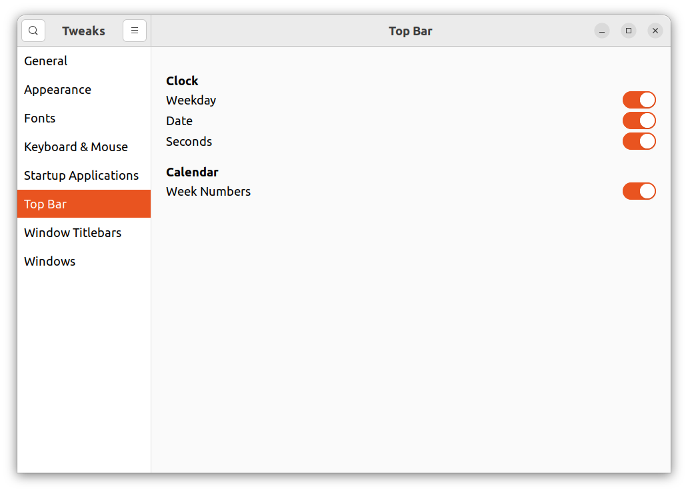

# Cl
My favorite command-line commands
 * [add_clip: send text to clipboard](add_clip.md)
 * [convert_all_html_to_md: convert all HTML files to Markdown](convert_all_html_to_md.md)
 * [remove_pro_user_files: Remove all .pro.user files recursively](remove_pro_user_files.md)

## Need some revision
 * [Add a folder to the path](ClAddFolderToPath.md)
 * [Compare two images](ClCompareImages.md)
 * [Convert a dot graph](ClConvertDotGraph.md)
 * [Convert BMP to PNG](ClBmpToPng.md)
 * [Convert Markdown to HTML](ClConvertMdToHtml.md)
 * [convert Maxima to TeX](ClMaximaToTex.md)
 * [Convert MP3 to OGG](ClMp3ToOgg.md)
 * [Convert ODT to PDF](ClOdtToPdf.md)
 * [Convert uppercase to lowercase](ClConvertUppercaseToLowercase.md)
 * [Convert WAV to OGG](ClWavToOgg.md)
 * [Disk space left](ClDiskSpaceLeft.md)
 * [Espeak with a Dutch voice](ClEspeakDutch.md)
 * [Espeak with a Swedish voice](ClEspeakSwedish.md)
 * [Find text in files](ClFindTextInFiles.md): find a regex in regex-named files in all subfolders
 * [Find Rhythmbox playlists](ClFindRhythmboxPlaylists.md): find the path of your Rhythmbox playlists
 * [Find Word edited HTML files](ClFindWordEditedHtml.md)
 * [Fix: keyboard layout resets at reboot](ClFixKeyboardLayoutResetsAtReboot.md)
 * [Get my github repository size](ClGetGitHubRepositorySize.md)
 * [git tricks (or: my favorite git commands)](ClGitTricks.md)
 * [HasPae](ClHasPae.md): Do I have PAE?
 * [Host key verification failed](ClHostKeyVerificationFailed.md)
 * [Install](ClInstall.md)
 * [Install LOGO Comfort](ClInstallLogoSoftComfort.md)
 * [IsValidHtml](ClIsValidHtml.md): checks if a webpage is valid using surfraw and W3C validation service
 * [Login to the Alfa College (Groningen, The Netherlands) wireless network](ClLoginAlfaCollege.md)
 * [ReadWebpage](ClReadWebpage.md): reads a webpage and saves it as a text file
 * [Set the number of workspaces](ClSetNumberOfWorkspaces.md)
 * SLOCCount for no overhead and Dutch minimum wages 
 * Start an application from terminal and make it run autonomously 
 * [Sum the size of all files with a .md extension](ClSumSizeHtml.md)
 * [TorChromium](ClTorChromium.md): use the Tor service under Chromium
 * [TorLynx](ClTorLynx.md): use the Tor service under Lynx
 * [Pack2port script](ClPack2port.md): script to compress multiple folders and mimicking folder structure
 * [View a dot graph](ClViewDotGraph.md)
 * [View virtual memory](ClViewVirtualMemory.md)
 * [Use a webcam](ClWebcam.md)

## Digital clock settings

Use 'GNOME Tweaks':

Old-skool is to use:
```
%Y-%m-%d     %R:%S
```
Since Jammy, I cannot find the field where to paste this format text.

## `man` alias
Add to `.bashrc`:
```
alias woman=man
```
Now you can read the documentation using
```
woman cat
```
## `clip` alias
Add to `.bashrc`:
```
alias clip='xclip -selection clipboard'
```
## Find owner of file
For example,
```
dpkg -S /usr/include/GL/gl.h
```
## Resize images
```
for img in *.*; do convert -resize 50% "$img" "opt-$img"; done
```

## Show week number in Ubuntu calendar
From [here](https://askubuntu.com/a/1093293):
```
dconf-editor
```
Then navigate to `/org/gnome/desktop/calendar/show-weekdate`
## Edit keyboard layout
Thanks to https://help.ubuntu.com/community/Custom%20keyboard%20layout%20definitions :
 * Copied `no` (Nordic) for `/usr/share/X11/xkb/symbols` to here
 * Copied `no` to to `no_arrogant` (my keyboard is of a brand called 'arrogant'
 * Modified `no_arrogant`
 * ´cp no_arrogant /usr/share/X11/xkb/symbols/no´
 * ´cd /var/lib/xkb/ ; sudo rm *.xkm´

## Swapfile
From https://linuxhandbook.com/increase-swap-ubuntu/
Read:
```
swapon --show
```
Turn off swap:
```
sudo swapoff /swapfile
```
Create a 20 GB swapfile:
```
sudo fallocate -l 20G /swapfile
```
Mark the swapfile:
```
sudo mkswap /swapfile
```
Enable the swapfile:
```
sudo swapon /swapfile
```
