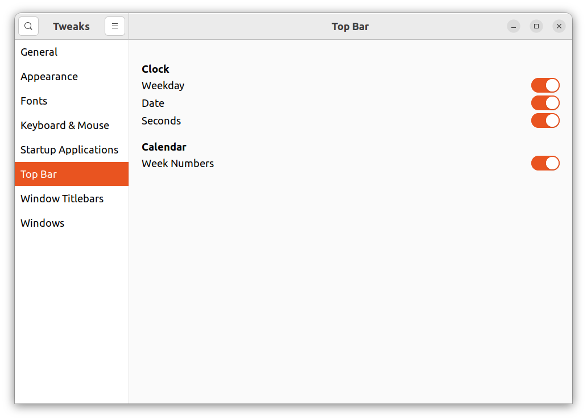

# Set the time

I like my clock to show the day of the week, as well as the settings

## 24.04 LTS Noble Nimbat

Under 'Settings':


## 22.04 LTS Jammy Jellyfish

Use 'GNOME Tweaks':



## 20.04 LTS Focal Fossa

Use this time string somewhere, I forrgot where:

```
%Y-%m-%d     %R:%S
```

