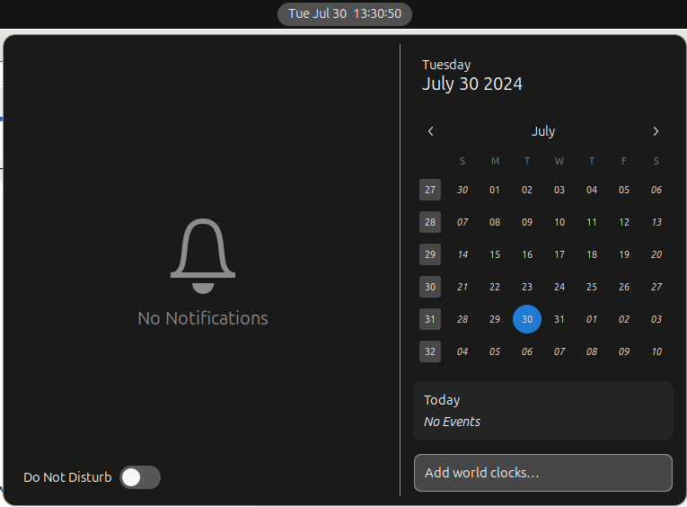
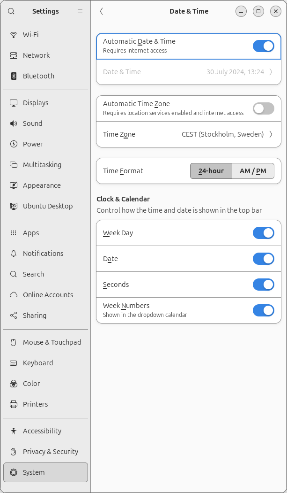

# Show week number in Ubuntu calendar

I like to see the week number in the Ubuntu calendar



## 24.04 LTS Noble Nimbat

Under 'Settings':



## 22.04 LTS Jammy Jellyfish

From [here](https://askubuntu.com/a/1093293):

```bash
dconf-editor
```

Then navigate to `/org/gnome/desktop/calendar/show-weekdate`
